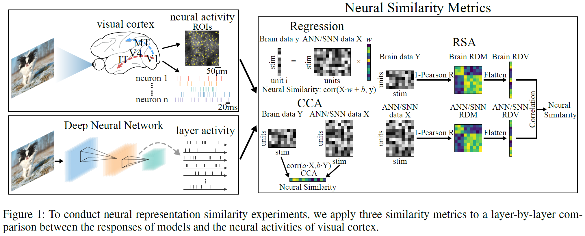

# SNN-Neural-Similarity-Static

Official implementation of "[Deep Spiking Neural Networks with High Representation Similarity Model Visual Pathways of Macaque and Mouse](https://doi.org/10.1609/aaai.v37i1.25073)" (**AAAI2023 Oral**). See [preprint](https://arxiv.org/abs/2303.06060) for appendix.

By Liwei Huang, Zhengyu Ma, Liutao Yu, Huihui Zhou, Yonghong Tian.

We are the first to apply deep SNNs to fit neural representations and shed light on visual processing mechanisms in both macaques and mice, demonstrating the potential of SNNs as a novel and powerful tool for research on the visual system.



## Requirements

In order to run this project you will need:

- Python3
- PyTorch>=1.5.0, please refer to [https://pytorch.org/get-started/previous-versions/](https://pytorch.org/get-started/previous-versions/)
- SpikingJelly
```
pip install spikingjelly==0.0.0.0.14
```
- The following packages: numpy, tqdm, scikit-learn, timm>=0.6.5

## SNN Training

The code is stored in the file folder `train`. It supports single GPU or multiple GPUs.

Train on the ImageNet:

```
python train_imagenet.py --epochs 320 --batch-size 32 --opt sgd --lr 0.1 --lr-scheduler cosa --lr-warmup-epochs 5 --lr-warmup-decay 0.01 --amp --model-name sew_resnet18 --T 4 --output-path logs/
```

The checkpoints of all pretrained SNNs in the paper are available at [https://drive.google.com/drive/folders/1oRplrHdJDnONhYWRvP5VP0sU4G8NuMfq?usp=sharing](https://drive.google.com/drive/folders/1oRplrHdJDnONhYWRvP5VP0sU4G8NuMfq?usp=sharing).

## Representational Similarity

The code is stored in the file folder `similarity`.

The experiments are performed on three datasets. For data preprocessing, please see the official implementation of the public dataset and the introduction of the paper:

- [Allen Brain mouse](https://allensdk.readthedocs.io/en/latest/visual_coding_neuropixels.html)
- [Macaque-Face](https://doi.org/10.1016/j.cub.2021.04.014) (available on request)
- [Macaque-Synthetic](https://github.com/brain-score/vision/blob/master/examples/data_metrics_benchmarks.ipynb)

The preprocessed neural data of **Allen Brain mouse dataset** and **Macaque-Synthetic dataset** are available at [https://drive.google.com/drive/folders/1Bps5hvNFS6_k7y-FrJHSBie8eS0rPb1p?usp=sharing](https://drive.google.com/drive/folders/1Bps5hvNFS6_k7y-FrJHSBie8eS0rPb1p?usp=sharing) and the preprocessed visual stimuli used in the corresponding biological experiments are available at [https://drive.google.com/drive/folders/1JRJQfwH_1QZAqAiUQKt6D9TAR7KJ-RbJ?usp=sharing](https://drive.google.com/drive/folders/1JRJQfwH_1QZAqAiUQKt6D9TAR7KJ-RbJ?usp=sharing).

Test on the Allen Brain mouse dataset:

```
python similarity.py --model sew_resnet18 --train-dataset imagenet --checkpoint-path model_checkpoint/sew_resnet18.pth --neural-dataset allen_natural_scenes --neural-dataset-dir neural_dataset/ --metric SVCCA --stimulus-dir stimulus/ --output-dir results/
```

## Acknowledgement

We thank L. Chang for providing Macaque-Face dataset.

## Citation

If you find our work is useful for your research, please kindly cite our paper:

```
@article{Huang_Ma_Yu_Zhou_Tian_2023,
    title={Deep Spiking Neural Networks with High Representation Similarity Model Visual Pathways of Macaque and Mouse},
    volume={37},
    url={https://ojs.aaai.org/index.php/AAAI/article/view/25073},
    DOI={10.1609/aaai.v37i1.25073},
    number={1},
    journal={Proceedings of the AAAI Conference on Artificial Intelligence},
    author={Huang, Liwei and Ma, Zhengyu and Yu, Liutao and Zhou, Huihui and Tian, Yonghong},
    year={2023},
    month={Jun.},
    pages={31-39}
}
```